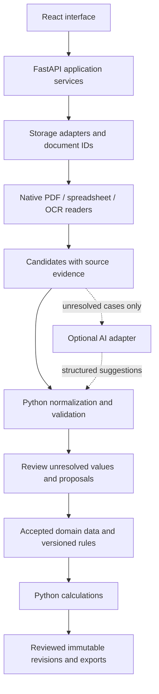

# Platform review and improvement plan

Reviewed: 13 September 2026. Scope: the supplied backend, frontend, configuration, migrations and tests. This is a review and implementation plan; production application code and the existing database were not changed.

**Main conclusion**

The platform already has the Python foundation requested. No Claude, OpenAI, Gemini or other generative-model integration was found in the application source or declared dependencies. DRF and BOQ extraction use PyMuPDF, image processing and Tesseract; battery and amplifier calculations run in Python. The work needed is to isolate reusable business rules, make document storage portable, and prevent incomplete or inferred data from becoming authoritative.

Keep the existing application and refactor it incrementally. A single backend with clear internal modules is sufficient initially. Introducing several independently deployed services or an AI framework now would add work without resolving the identified defects. React can remain the interface: the authoritative validation, calculations and workflow decisions should live in Python.

Tesseract itself uses trained recognition models. Here, “deterministic” should mean explicit business decisions and reproducible processing with pinned inputs, versions and settings. It does not mean OCR is guaranteed correct. A repeatable recognition error is still an error.

**What is already worth preserving**

| Area | Existing foundation | Main gap |
|---|---|---|
| API and identity | FastAPI, cookie authentication, role checks and login lockout | Unsafe bootstrap defaults and client-supplied filesystem boundaries |
| Data | SQLAlchemy and Alembic; migration/model consistency test | Machine-specific document references and incomplete audit history |
| Extraction | Python OCR, explicit template heuristics, extraction warnings | Missing rows/pages and weak evidence retention |
| Calculations | Python battery/VE functions; constrained design schemas | Shared catalog assumptions, inconsistent number parsing and rule lifecycle |
| Review | DRF review form, editable BOQ, read-only re-extraction comparison | No consistent proposal/validation/acceptance lifecycle |
| Issuance | Frozen BOQ revisions and submittal events | No equivalent issued calculation snapshot |
| Portability | Central Pydantic settings; environment-configurable roots | Persisted absolute paths, current-directory dependence and Word/fonts |
| Quality | Substantial backend suite; frontend build/lint commands | OCR coverage skipped here, no frontend test script or visible CI workflow |

**Verified results and limits**

- Backend: **379 passed, 32 skipped, 1 deprecation warning**, in 163.42 seconds. Command from `backend`: `venv\Scripts\python.exe -m pytest tests -q -p no:cacheprovider --tb=short`.
- The first sandboxed test attempt encountered temporary-directory permission errors. The successful run above was the approved rerun outside that restriction; those initial errors are not application test failures.
- Frontend: `npm.cmd run build` passed. `npm.cmd run lint` passed with **12 warnings** concerning state updates in effects and Fast Refresh exports.
- The supplied test suite contains OCR and live-archive gates. The passing run does **not** establish OCR accuracy on the user's real archive or on unfamiliar templates. No live-archive accuracy claim is made.
- [review_checks.py](review_checks.py) reproduces selected issues with synthetic values. It uses an in-memory database configuration and does not read the archive or modify the application database. It documents current behavior, not acceptance criteria to retain after fixes.
- The installed PyMuPDF successfully opened and rendered a synthetic XLSX. Excel support must therefore not be described as universally broken; the problem below is the BOQ extraction strategy.
- `git status` reported that this directory is **not a Git repository**. It looks like a source-folder snapshot. Commit history, remote configuration and whether sensitive files were ever tracked could not be assessed.
- This was a source and automated-check review, not a browser walkthrough, load test, dependency vulnerability audit, or verification of engineering code compliance. Existing installed dependencies were used; installation on a clean computer was not tested.

**Priority findings**

P1 means address before wider/shared deployment or relying on the affected output. P2 means address in the portability and reuse refactor. Severity reflects the code path and its preconditions, not an assertion that an incident occurred.

**1. P1 — Client input can define filesystem trust boundaries.**

Evidence: `backend/app/schemas_project.py:12–22` only strips the EP prefix and rejects empty strings. `ProjectCreate` accepts raw source/document paths. `backend/app/routers/projects.py:175–176` persists them, and `_save_upload` at line 651 constructs the upload directory using the EP number. Log-file access checks containment against the stored project root, which the same client can choose during creation.

An authenticated project creator can supply an EP containing separators and `..`; the review check proves its computed upload directory escapes `UPLOADS_ROOT`. A caller-selected source root can also expand document reads to permitted file types elsewhere on the server, subject to the service account's access. Authentication alone does not make those paths trusted.

Change: use a server-generated project/document ID for storage folders; validate business identifiers against the chosen project profile; accept document IDs from resolution/upload rather than arbitrary paths. Resolve and enforce containment against configured storage roots at every adapter boundary, including symlinks/junctions. Never use an EP label or system label as a filesystem path.

Acceptance: traversal, absolute paths, UNC paths and junction escapes are rejected; valid documents remain available by ID; no request can select a new server filesystem root.

**2. P1 — Authentication can start with public or empty credentials.**

Evidence: `backend/app/core/config.py:15–24` contains a known development JWT secret and default admin password; `backend/.env.example` has an empty `SECRET_KEY`; `backend/app/seed.py:90` creates the configured administrator if absent. `Settings(_env_file=None, secret_key="")` succeeds in the synthetic check.

This is a configuration weakness, not a claim about the actual contents of the user's private `.env`. A deployment that omits or copies configuration without completing it can be insecure while appearing healthy.

Change: introduce an explicit environment mode; refuse empty/known development secrets in production; validate secure cookie configuration; use an explicit one-time administrator bootstrap. Do not silently seed an administrator on every production startup. Require validated positive values for token/lockout settings.

Acceptance: production startup fails for blank/default secrets and default bootstrap credentials; a correctly configured fresh instance and an existing instance start predictably.

**3. P1 — BOQ extraction silently loses evidence of incomplete reads.**

Evidence: `backend/app/services/design_sheet_extractor.py:351–388` skips pages with unrecognized layouts and filters out lines without a recognized quantity. `ExtractedBoqLine` includes page/confidence, but `backend/app/routers/projects.py:353–369` saves only the business fields. `ProjectBoqItem` has no source-page, bounding-box, extractor-version or review-status columns.

A readable subset can become a saved BOQ even when a real row or page is missing. The existing README explicitly documents an archive example returning 11 of 12 lines; that example was not independently rerun here. The one-time extraction stamp and warnings are useful, but cannot recover discarded candidates.

Change: return an extraction envelope containing accepted candidates, unresolved candidates, page outcomes and completeness warnings. Preserve uncertain rows for review. Persist source document hash, page/cell coordinates, raw text, normalized value and parser version. Require explicit resolution of material incompleteness before issuing a revision; allow ordinary draft editing.

Acceptance: one unreadable quantity remains visible as an unresolved item; a skipped page marks extraction partial; a later correction preserves the original evidence; unknown values never silently become zero.

**4. P1 — Automatic zero-current inference updates the global rule catalog.**

Evidence: `frontend/src/pages/ProjectBatteryPage.tsx:109–139` calls `fill-currents` automatically on an editor's visit. `backend/app/routers/design.py:284–336` records missing currents in shared rules. `backend/app/services/battery_calculation.py:59–63` classifies descriptions containing words such as `cabinet` or `plate` as mechanical. The synthetic description “Powered cabinet with monitoring electronics” matches that rule.

A text heuristic can therefore become a shared zero-current fact used by subsequent calculations and other projects. This is an actual automatic rule path; the example demonstrates classifier behavior, not a measured error in a real project.

Change: keep extracted/classified values as proposals; use manufacturer/model-specific verified component records for zero-load facts. Require an explicit accepted source for a rule that determines calculation completeness. If a component is included in a host module, validate that the host is present and counted in the correct assembly.

Acceptance: an unknown powered cabinet stays unresolved; visiting a page does not publish shared rules; approved mechanical or included-in-host records retain their evidence and reviewer.

**5. P1 — Business validation and numeric parsing disagree across modules.**

Evidence: `ProjectBoqItemIn` in `backend/app/schemas_project.py:60` accepts an empty description, negative quantity text, negative price, and an unrelated total price. `frontend/src/lib/boq.ts` and `backend/app/services/boq_export.py:71` parse `1,000` as 1000, while `backend/app/services/battery_calculation.py:95` returns no numeric value for it. Synthetic checks reproduce both behaviors.

Change: add a Python domain validator shared by save, import, comparison, export and calculation. Model quantity as a typed value with its unit and optional original text; retain `Lot` as an explicit nonnumeric case. Define decimal/thousands separator policy. Compute totals on the server, or represent an independently quoted total with an explicit override/reason. Keep UI checks for immediate feedback, backed by the same server contract.

Acceptance: API calls cannot bypass required fields or quantity/price policy; identical quantities have identical interpretations across BOQ, battery and export; totals have one documented meaning.

**6. P1 — Changing environment variables does not relocate existing projects.**

Evidence: `backend/app/models.py:107–108`, line 307 and line 350 store source, DRF, design-sheet and submittal paths. Creation persists client/resolver paths; upload returns `str(path.resolve())`. Compliance, calculation and logs later use `Path(project.source_folder_path)` directly.

An office database brought home still points to office locations. Updating `PROJECTS_ROOT` changes future resolution but does not reinterpret all existing references. A re-extraction fallback searches for a folder but is not a general migration.

Change: store `storage_backend + root_alias + relative_key` for local documents, or provider item IDs for remote storage. Resolve physical roots from settings only at access time. Migrate existing references using an explicit old-root-to-alias mapping; produce a dry-run report of unmapped or ambiguous references before applying it.

Acceptance: restore the same synthetic project database and files under two different roots, change only machine settings, and successfully open documents, calculate, compare and export without editing database paths.

**7. P1 — Re-extraction can compare against the wrong archive folder.**

Evidence: `backend/app/services/reextraction.py:208–216` warns on multiple matches and returns `matches[0]`. This contradicts its nearby comment and the resolver's safer ambiguity behavior. The DRF paths also select the first candidate when several exist. `_compare_sheets` reads discovered archive sheets, so uploaded sheets are not included as extraction sources in the same way.

Change: require stable source identity or explicit selection on ambiguity; sort only for display, never to choose authority. Re-extract registered document versions plus explicitly proposed discoveries. Mark failed/unread sheets as unknown instead of interpreting missing extracted items as confirmed removals.

Acceptance: two matching project folders produce a selection requirement; a failed source read cannot generate an authoritative removal; uploaded and archive sources participate in the same review workflow.

**8. P1 — Opening an uploaded specification depends on an archive folder existing.**

Evidence: `backend/app/routers/compliance.py:68–75` returns before the uploads scan if `source_folder_path` is absent or unreachable. The synthetic check reproduces that early return. `_save_upload` can still accept the file.

Change: discover archive and uploaded specifications independently and merge their results. Preserve an archive-unavailable warning while returning uploaded matches. Include relevant document/system versions in the cache identity and invalidate after changes.

Acceptance: a project with no archive, or a disconnected office drive, can upload and list its specification immediately. Readability of the local upload does not depend on the archive.

**9. P1 — Upload names can collide and contents are not validated by purpose.**

Evidence: `backend/app/routers/projects.py:638–655` checks extension, nonempty content and size, then uses a label plus a timestamp with one-second precision and `write_bytes`. Same-label uploads within one second can overwrite the same file. The shared suffix list also permits Excel on a DRF/specification endpoint without checking that the downstream workflow can use it.

Change: generate unique document IDs and immutable version names, write atomically, inspect actual format, and enforce a per-document-purpose reader registry. Bound page counts, expanded archive sizes, render dimensions and processing time as well as uploaded bytes. These controls align with [OWASP's file-upload guidance](https://cheatsheetseries.owasp.org/cheatsheets/File_Upload_Cheat_Sheet.html).

Acceptance: concurrent same-name uploads produce distinct versions; a renamed invalid file fails at upload with a useful message; interrupted processing never replaces an earlier valid document.

**10. P1 — Spreadsheet exports can turn user text into formulas.**

Evidence: `backend/app/services/boq_export.py:148–162` assigns descriptions, catalog numbers and remarks directly to openpyxl cells. The synthetic check verifies that `=1+1` assigned this way has formula type. No Excel execution or external-link payload was used during review.

Change: explicitly serialize user/document-derived text as text cells; generate formulas only in intended numeric/formula columns. Apply the same rule to all export services.

Acceptance: a description beginning with `=` remains literal text after saving and reopening the workbook, while platform-created total formulas still work.

**11. P2 — Extraction needs format-specific readers and explicit profiles.**

Evidence: `drf_extractor.py:416–428` always renders the first page. `design_sheet_extractor.py:351` renders every page and applies a small set of grid layouts. There is no native spreadsheet-cell branch in that BOQ entry point. The installed PyMuPDF can render XLSX, but rendering cells and OCR-reading them adds recognition uncertainty and still requires a supported table layout.

Change: read digital PDF words/tables first when their geometry and text are usable; use OCR for scanned regions; read XLSX/XLSM cells with openpyxl. Register different DRF, BOQ and workbook profiles with explicit recognition criteria and an unsupported/ambiguous outcome. Preserve original formulas and distinguish stored formula results from recalculated ones; openpyxl is not a calculation engine. Treat legacy XLS support as a separate supported-format decision.

PyMuPDF documents conditional OCR and reuse of its results; that supports the proposed text-first/OCR-fallback approach. The existing specialized grid OCR can remain a fallback for its proven layouts. [PyMuPDF OCR documentation](https://pymupdf.readthedocs.io/en/latest/recipes-ocr.html).

Acceptance: the same BOQ represented as digital PDF, scan and XLSX produces the agreed normalized values with evidence; unsupported layouts fail clearly; multi-page DRFs do not silently ignore required later-page fields.

**12. P2 — The rule catalog is insufficiently scoped for reuse.**

Evidence: `backend/app/routers/design_rules.py` saves part currents and batteries keyed by `part_key(part_no)`; manufacturer is not part of rule identity. `DesignRule` uniqueness is category/key/version. `seed.py` contains company-approved project-derived defaults; system aliases and template conventions are scattered across resolver, project, compliance, battery and submittal code.

Change: use manufacturer + normalized model + variant/operating conditions for component identity. Use named, versioned project/company profiles for system aliases, templates, selection preferences and approved rule sets. Keep algorithms in Python and profile data in schema-validated JSON/YAML or versioned database records. A profile must not execute arbitrary code.

Acceptance: two manufacturers may use the same model label without sharing currents; an alternative company/template profile works without changes to the calculation functions; a profile update does not silently alter issued work.

**13. P2 — Rule versions alone do not make issued calculations reproducible.**

Evidence: VE copies its limit at import; battery calculation intentionally reads currently active rules and BOQ on each request (`backend/app/routers/design.py:344`). Draft recalculation is useful, but there is no persisted issued calculation result with immutable inputs and complete rule references. BOQ revisions already demonstrate the desired snapshot pattern.

Change: distinguish live draft calculations from issued calculation revisions. Snapshot normalized inputs, BOQ revision, component/rule versions, source hashes, engine version, overrides and approver at issuance. Preserve the generated artifact or its verifiable identity. Governance should distinguish a rule proposal, approval, activation and supersession; engineering authority must validate applicability of each rule set.

Acceptance: a later catalog correction updates a draft while an issued calculation can still reproduce its original values; switching to newer rules is an explicit recorded action.

**14. P2 — Concurrent saves can overwrite another engineer's work.**

Evidence: `backend/app/routers/projects.py:272–295` replaces the whole BOQ without an expected revision/version. Project and design saves also lack a shared optimistic concurrency contract. BOQ extraction has a useful atomic claim, but that protects extraction duplication, not concurrent editing.

Change: add an incrementing version or ETag; require it on updates; return a conflict and a comparison when stale. Record actor, before/after and source in an audit event. Separate stable BOQ line identity from presentation order where practical.

Acceptance: two editors saving from the same version cannot silently overwrite one another; retrying an accepted operation does not duplicate it.

**15. P2 — Processing and cache state are tied to a single process.**

Evidence: `backend/app/services/log_scan_jobs.py:15–27` retains jobs in a global dictionary and starts daemon threads. BOQ and current-fill locks are process-local; several OCR paths have no explicit Tesseract timeout. Startup launches datasheet warming threads and runs migrations.

Change: use bounded background processing with persisted job state, retries, cancellation and per-document idempotency. Start with a simple worker and database job table if sufficient; add a dedicated queue when measured concurrency warrants it. Define timeout/page/pixel limits and close document handles with context managers. For multi-worker deployments, run migrations as a controlled deployment step and coordinate jobs across workers.

Acceptance: restart does not lose the job record; polling sees the same state across workers; a stuck OCR subprocess times out; one large document does not block unrelated work indefinitely.

**16. P2 — Configuration still depends on launch location and host software.**

Evidence: `backend/app/core/config.py:7` loads `.env` relative to the working directory; the default SQLite URL and uploads path are relative too. `submittal_package.py:434–438` contains Windows font paths and its warranty conversion uses Word COM with a fallback. `frontend/src/lib/api.ts:1` defaults to browser-local `localhost:8000`; branding is separately embedded in `frontend/src/branding.ts`.

Change: define a stable application/data base directory, resolve configuration once, and validate roots at startup. Expose capabilities for OCR, archive, library and document conversion separately from liveness. Make fonts/templates/profile configurable and preserve clear output-quality warnings for fallback rendering. Prefer a same-origin API path for hosted use. If using `VITE_API_BASE_URL`, document that it is embedded at build time and is public, so it cannot contain a secret. [Pydantic settings](https://docs.pydantic.dev/latest/concepts/pydantic_settings/), [Vite environment variables](https://vite.dev/guide/env-and-mode).

Acceptance: starting from root, backend or a service launcher uses the same configured database and uploads; a browser on another computer reaches the intended API; missing optional capabilities are reported without claiming full readiness.

**Additional product and maintenance improvements**

| Item | Observation and action |
|---|---|
| Project permissions | All authenticated roles may list/read all projects, and creator roles can edit projects generally. Existing tests explicitly reflect this. Preserve it if company-wide access is intended; add project membership and scoped checks before external clients or separate organizations share an instance. |
| Compliance scope | The module discovers specifications and drafts a request mail. It does not yet perform a clause-by-clause compliance assessment. Track requirement, evidence, result, exception and reviewer separately when implementing that feature. |
| Planned modules | Drawings/O&M/Reports/Team/Settings and parts of calculations/BOQ are marked as future work. Track these as missing capabilities, not completed AI functions. |
| Operational state | `/health` reports app liveness only. Add readiness checks, structured request/job logs, timings, extraction warning counts and failed-job visibility without logging secrets or full source documents. |
| List performance | Project listing returns all records and nested data. Add pagination and summary payloads; inspect query counts before an archive grows. |
| Frontend | Address the 12 lint warnings and add critical workflow tests for review, save conflicts, upload-only projects and document errors. Build success alone does not verify those interactions. |
| Dependencies | Requirements are pinned and a frontend lockfile exists. Document Python/Node/OCR versions and validate a clean install. Add dependency/security checks to CI; this review makes no claim that installed versions are vulnerability-free. |
| Repository hygiene | Root `.gitignore` excludes `.env`, `*.db`, venv, caches and builds, but not variants such as `.env.home`, `.env.office`, `.venv`, SQLite sidecars or arbitrary data roots. Expand patterns and explicitly keep sanitized `.env.example` files. Ignore patterns cannot remove already tracked history; audit the real repository before publishing. |
| Backups | Code, machine settings and business data are separate deliverables. Provide a tested database/files backup and restore process. Copying `.env` does not copy the database, documents, rule catalog or installed OCR/Word dependencies. |

**Target architecture**



Suggested internal packages, introduced gradually rather than by moving every file at once:

```text
backend/app/
  core/                  settings, identity, authorization
  domain/                typed quantities, documents, rules, calculations
  application/           extraction, review, issuance, project workflows
  infrastructure/
    storage/             local now; remote adapter when needed
    extraction/          PDF text, spreadsheet cells, OCR
    ai/                  disabled adapter; optional provider implementations
    persistence/         database and repositories
  profiles/              schemas for company/template/system configuration
  routers/               transport, request/response mapping
```

Current routers import private helpers from other routers, for example compliance imports project upload helpers and design imports catalog functions. Move those shared operations into application services. Domain calculations should not import routers, global settings, ORM sessions or AI clients. They should receive typed values and return results plus rule/evidence references.

**The AI boundary**

AI is not currently required and should be added only after the preceding foundation is working. Useful optional tasks are suggesting a field mapping for an unfamiliar document, explaining validation failures, retrieving relevant approved rules, or drafting a narrative against selected evidence.

The AI contract should return structured proposals: field, proposed value, source document/page or cell, explanation and provider/model/prompt version. Its output must pass the same Python schema and business validation as manual or extracted inputs. A model-reported confidence is not a calibrated correctness score.

AI must not assign engineering pass/fail, invent missing quantities or currents, publish rules, alter accepted records, or execute generated Python/SQL. If natural language selects a calculation, dispatch only to allowlisted existing Python functions with validated arguments and normal authorization. Treat document text as untrusted content, including instructions embedded in it. Give a provider only the evidence needed for the authorized task, not unrestricted archive access.

Default `AI_ENABLED=false` is a proposed future setting, not an existing feature. With AI off, unavailable, over budget or returning malformed output, extraction, validation, calculation, manual review and export must continue normally. Do not introduce a model-training project yet: first build a representative labeled document set, measure baseline extraction errors, and determine whether optional assistance improves unresolved cases. Human corrections can inform reviewed parser/profile updates and evaluations; they must not automatically rewrite authoritative rules.

**Home/office configuration model**

Use one settings schema, a sanitized example and private machine-specific values. Centralization means one definition and validation path, not that browser-visible configuration and server secrets should share exposure.

| Proposed setting group | Purpose | Transfer behavior |
|---|---|---|
| App environment and data root | Stable base for runtime state | Machine-specific, validated |
| Database URL | Connection to persisted project/rule data | May differ between machines; transfer or share data deliberately |
| Storage roots | Map `archive`, `uploads`, `library` aliases to physical folders | Change physical roots without changing document records |
| OCR executable and language data | Recognition capability | Install on each machine; pin compatible versions |
| Company/project profile | System names, templates, branding, approved defaults | Same profile version can be used on both machines |
| Secrets and cookie/origin settings | Identity and deployment access | Private, outside source control; values appropriate to each environment |
| Optional AI provider configuration | Proposal assistance only | Server-only, disabled by default |

Example document identity after the storage refactor:

```json
{
  "id": "document-uuid",
  "storage_backend": "local",
  "root_alias": "archive",
  "relative_key": "Client-A/EP-30784/Scan/DRF.pdf",
  "sha256": "<computed-content-hash>",
  "version": 1
}
```

At the office, `archive` may map to a synced company directory; at home it maps to the permitted local copy. The database stores neither user's home directory. For a remote provider, use its stable item identifier through the same storage interface.

For independent local instances, transfer a consistent database-and-document snapshot while writers are stopped, then restore and verify it. For simultaneous home/office use, operate one shared backend/database with controlled document access instead of trying to merge two independently edited SQLite copies. Do not use GitHub or `.env` files as a business-data synchronization mechanism.

**Delivery sequence and definition of done**

| Step | Concrete change set | Completion evidence |
|---|---|---|
| 1. Input and deployment correctness | Findings 1, 2, 5, 8, 9, 10: identifiers/storage boundaries, bootstrap validation, BOQ rules, upload-only specs and literal exports | Targeted regressions plus existing suite pass; invalid input fails with clear errors |
| 2. Portable storage/settings | Finding 6 and 16: document references, root mapping, migration dry run, stable settings and capability checks | Same fixture database/files work under two machine roots; restore succeeds |
| 3. Extraction evidence and review | Findings 3, 7, 11: format registry, document outcomes, candidate persistence, ambiguity handling and accepted-change workflow | Representative gold fixtures preserve all expected rows; unknowns remain visible; corrections survive re-extraction |
| 4. Reusable rules and issuance | Findings 4, 12, 13, 14: scoped catalogs/profiles, rule approval, calculation snapshots and save conflicts | Second manufacturer/profile works without algorithm edits; issued values remain reproducible; stale saves conflict |
| 5. Operational reliability | Finding 15 plus CI, frontend flows, logs and clean-install/restore documentation | Bounded jobs survive restart; Windows deployment is reproducible; Linux verified only if it is an actual target |
| 6. Optional AI trial | A provider-neutral proposal interface and a small approved evaluation set | AI-off suite passes with no AI credentials/network; malformed/adversarial suggestions cannot bypass validation; measurable benefit on unresolved cases |

Avoid one large rewrite. Keep API compatibility while moving one end-to-end workflow at a time. Use expand/backfill/verify migration steps, a pre-migration backup and an explicit rollback plan. Do not blindly replace path substrings or choose the first matching EP folder while migrating.

The first representative regression set should cover digital/scanned/mixed PDFs, table variants, multi-page documents, Arabic/English where required, decimal quantities, `Lot`, ambiguous catalog characters, unreadable quantities, duplicate EP folders, uploaded-only sources, differing roots, and two manufacturers sharing a model label. Report field accuracy, row recall, incorrect accepted values, unresolved rate and processing time separately. Passing arithmetic tests cannot establish document-extraction completeness.

The platform reaches the requested architecture when a second project/company profile and a second computer work with configuration/data changes alone, business decisions are traceable to versioned Python rules, uncertain extraction is visible, and disabling AI leaves every core workflow operational.
